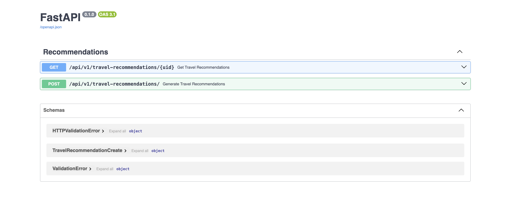

# ️⚡️ FastAPI Distributed Microserver ⚡️

## Project Description
The FastAPI Distributed Microservice suggests travel destinations based on the user's chosen country and preferred season.

The project is built on a microservice architecture and consists of two services: a backend-API service and a consumer service.

The backend-API service provides endpoints to receive a user's chosen country and season from the client. It then responds with travel recommendations.

The consumer service is responsible for integrating with third-party services to collect the necessary information. This information is then sent back to the backend-API service.

We use Kafka as a broker to connect the two services. This architecture allows for horizontal scaling by adding more consumer services to the broker.

## Table of Content
* [Project Description](#project-description)
* [Getting Started](#getting-started)
  + [Running Locally](#running-locally)
    + [Prerequisites](#local-prerequisites) 
    + [Setup](#local-setup)
  + [Running On Docker](#running-on-docker)
    + [Prerequisites](#docker-prerequisites) 
    + [Setup](#docker-setup)
  + [Continuous Integration](#continuous-integration)
  + [Continuous Deployment](#continuous-deployment)


## <a id="getting-started"> Getting Started </a>


## <a id="running-locally"> Running Locally</a>

### <a id="local-prerequisites"> Prerequisites</a>
  - Python >= 3.8
  - Pip >= 18.0
  - Kafka
  - Mongo

### <a id="local-setup"> Setup</a>
tbd

## <a id="running-on-docker"> Running On Docker</a>
### <a id="docker-prerequisites"> Prerequisites</a>
  - Docker - [Install Docker](https://www.digitalocean.com/community/tutorials/how-to-install-and-use-docker-on-ubuntu-20-04)
  - Docker-compose - [Install Docker-compose](https://www.digitalocean.com/community/tutorials/how-to-install-and-use-docker-compose-on-ubuntu-20-04)

### <a id="docker-setup"> Setup</a>
1. Create .env file same as .env.sample in the root folder and update the values
```bash
OPENAI_API_KEY=
```
2. Build:  `docker-compose build`
3. Run: `docker-compose up`

## Usage
1. Using curl or other tools, you can send requests to the endpoints through methods defined here:
```http://127.0.0.1:3000/```

2. Documents for testing can be found at here:
```http://127.0.0.1:3000/docs```




## <a id="continuous-integration"> Continuous Integration</a>
tbd

## <a id="continuous-deployment"> Continuous Deployment</a>
tbd